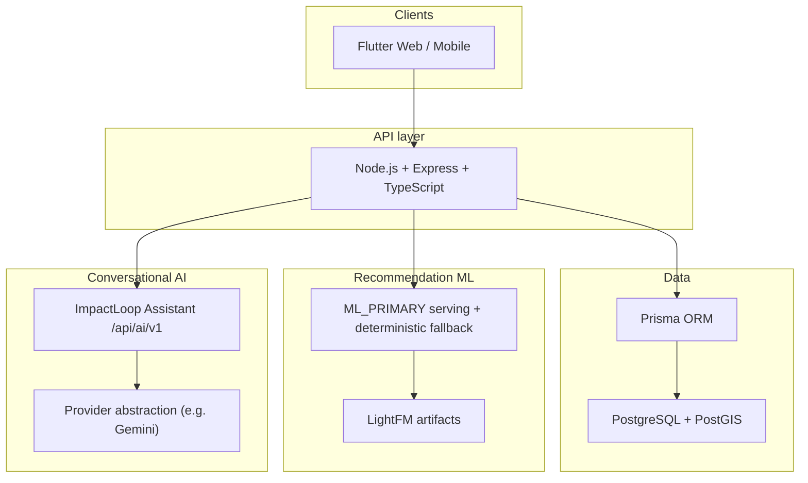

# ImpactLoop

ImpactLoop is a graduation software platform that connects surplus and reusable educational materials with learners, learning projects, and local fulfillment. Suppliers list available materials; learners discover items and projects, plan builds, reserve stock, and complete pickup or internal delivery with QR-backed handover confirmation. The platform includes personalized Learner Home recommendations (ML_PRIMARY serving with deterministic fallback), a conversational ImpactLoop AI assistant, and admin tooling for moderation, operations, and exports.

For detailed implementation status see [docs/product/implementation-status.md](docs/product/implementation-status.md).

---

## Problem

Usable surplus materials are often wasted or stored without reuse. Learners need affordable components for hands-on projects but face fragmented discovery, unclear availability, and weak links between project ideas and nearby stock. Donation and reuse workflows are rarely connected to structured learning paths.

---

## Solution

ImpactLoop implements an end-to-end reuse lifecycle:

```text
Supplier lists material
→ Learner discovers material or learning project
→ Build planning, material requests, and matching aids
→ Reservation (pickup or delivery)
→ Payment when required (CARD checkout or CASH at handover)
→ Pickup or internal delivery
→ QR / confirmation-code handover
→ Reuse completion and learner impact tracking
```

Delivery, driver assignment, incident recovery, and admin operational actions are **implemented in partial MVP form** — not merely planned. Realtime GPS streaming and a dedicated moderator portal are not implemented.

---

## User roles

| Role | Summary | Status |
|------|---------|--------|
| **Learner** | Discover materials and projects, reserve, pay, build, request missing materials, use AI assistant | **Implemented** (some flows partial) |
| **Supplier** | List and manage materials, handle reservations, verification, material-request responses | **Implemented** (some analytics/profile surfaces partial) |
| **Driver** | Accept jobs, update delivery status, scan/issue handover codes, share location pings | **Partial** — no background GPS or live route stream |
| **Admin** | Dashboard, invitations, moderation, people, deliveries/reservations monitors, exports | **Partial** — strong ops coverage; not every aspirational admin feature |
| **Moderator** | Content moderation queues | **Not implemented** as a portal — `MODERATOR` role exists; admin owns queues today |

Same account can hold multiple roles (e.g. learner + supplier) with portal switching.

---

## Major features

| Domain | Capabilities |
|--------|----------------|
| **Authentication** | Public learner/supplier registration, JWT + refresh tokens, forgot/reset password, role invitations (driver/moderator/admin), dual-role switching |
| **Material discovery** | Public browse/search, map pins, likes, saved locations, material reports |
| **Supplier portal** | Material CRUD, reservations workflow, verification, private profile management, material-request inbox |
| **Learning hub** | Published projects, saves/follows/likes/reviews, manual build checklists, learner submissions and admin moderation |
| **Material requests** | Learners request missing materials; suppliers suggest or publish from requests |
| **Reservations** | Partial-quantity holds, learner/supplier confirmation flows, scheduling proposals, incident reporting |
| **Payments** | `CARD` (Mock checkout when enforcement is on) and `CASH` (collected at handover, not checkoutable) |
| **Pickup & QR handover** | Learner/supplier/driver QR and confirmation codes with window timing rules |
| **Delivery** | Learner request, driver jobs, grouped deliveries, admin reopen-to-drivers, pickup-recovery actions |
| **Notifications** | Persisted learner inbox; supplier derived inbox; payment and delivery event types |
| **Learner home** | Personalized feed with ML-ranked suggested materials/projects plus deterministic sections |
| **Recommendations** | ML_PRIMARY LightFM serving with PostgreSQL retrieval and deterministic fallback |
| **ImpactLoop AI assistant** | `/api/ai/v1` — general learning chat, build-guide tools, project authoring waves |
| **Admin** | Approvals, moderation, people management, impact/audit views, CSV/XLSX/PDF exports (MVP) |

**Not shipped:** AI material-matching agent (credits/auto-reservation), moderator portal, real payment service provider, realtime delivery tracking.

---

## Architecture



Learner Home recommendations retrieve eligible candidates from PostgreSQL, rank with LightFM when artifacts are READY, and fall back to deterministic ordering when ML cannot safely serve. Conversational AI is a separate product boundary from recommendation ML. See [docs/architecture/system-overview.md](docs/architecture/system-overview.md) and [docs/architecture/recommendation-system.md](docs/architecture/recommendation-system.md).

---

## Technology stack

| Layer | Technologies |
|-------|----------------|
| **Frontend** | Flutter / Dart, Riverpod, GoRouter, Dio |
| **Backend** | Node.js, Express 5, TypeScript, Zod |
| **Database** | PostgreSQL, PostGIS (spatial queries), Prisma |
| **Recommendation ML** | Python training pipeline, LightFM, versioned JSON artifacts, TypeScript serving |
| **AI assistant** | Backend provider abstraction; no secrets in repository |
| **Testing / CI** | Backend `node --test` suites, Flutter `analyze`/`test`, GitHub Actions (`baseline-ci`, `recommendation-ci`) |

---

## Repository structure

```text
impactloop/
  apps/
    backend/          # Express API, Prisma schema, seeds, ML scripts
    frontend/         # Flutter client
  docs/               # Canonical project documentation
  ml/
    recommendation/   # Python LightFM training utilities
  .github/
    workflows/        # CI pipelines
```

---

## Local development

Full setup: [docs/development/local-development.md](docs/development/local-development.md)

**Essential path** (from repository root):

```bash
npm ci
npm run prisma:generate -w apps/backend
npm run prisma:migrate -w apps/backend
npm run prisma:seed -w apps/backend      # destructive core reset
npm run demo:seed -w apps/backend        # additive community demo
npm run backend:dev
```

**Flutter** (separate terminal):

```bash
cd apps/frontend
flutter pub get
flutter run -d chrome
```

Copy `apps/backend/.env.example` → `apps/backend/.env` and set `DATABASE_URL` before migrating. Default API: `http://localhost:4000` (`GET /health`).

---

## Demo data

| Command | Purpose |
|---------|---------|
| `npm run prisma:seed -w apps/backend` | Destructive core catalog + workflow scenarios |
| `npm run demo:seed -w apps/backend` | Additive graduation/community demo (people, materials, projects, behavior) |

Guide: [docs/demo-data.md](docs/demo-data.md)

**Local admin (after seed):** `admin@impactloop.test` — password from local seed (`prisma/seeds/seed-admin.ts`; do not commit credentials).

Community demo accounts use the `@impactloop.demo` email domain. Visual asset manifests live under `apps/backend/prisma/demo-data/visual-assets/`.

---

## Testing

```bash
# Backend
npm run backend:typecheck
npm run test -w apps/backend

# Flutter
cd apps/frontend
flutter analyze
flutter test
```

Recommendation and baseline CI scripts are available from the root `package.json` (`ci:baseline:*`, `ci:recommendations:*`). See [docs/product/implementation-status.md](docs/product/implementation-status.md) for coverage notes.

---

## Technical highlights

- **Reservation lifecycle** — partial-quantity holds, lazy expiry, no-driver and stale-pickup escalation, incident queues
- **QR handover** — learner, supplier, and driver QR/confirmation flows with grace windows
- **Delivery operations** — grouped deliveries, admin pre-pickup reopen, pickup-recovery actions (reschedule/cancel-release-hold)
- **Payment semantics** — `CARD` Mock checkout vs `CASH` due at handover; fulfillment gates before codes and driver notify
- **ML_PRIMARY recommendations** — LightFM artifacts, feature-token contract, observability, deterministic fallback
- **Role-aware access control** — JWT, role middleware, owner-scoped reads
- **Admin exports** — reservations, materials, deliveries, people, incident reports (MVP)
- **Bilingual UX** — Arabic/English UI with RTL support in Flutter

---

## Current scope and limitations

| Area | State |
|------|--------|
| Delivery | **Partial** — request/status/polling map; no realtime stream or post-pickup retry |
| Payments | **Mock MVP** when `PAYMENT_PROVIDER=mock`; production intent uses `disabled` — no real PSP |
| AI material-matching agent | **Not implemented** (separate from ImpactLoop Assistant) |
| Moderator portal | **Not implemented** |
| Public supplier profile | **Deferred** — private supplier profile management exists |
| Recommendation ML | **Implemented** with artifact readiness gates; not all sections are ML-ranked |

Unresolved items: [docs/product/open-questions.md](docs/product/open-questions.md)

---

## Documentation

| Document | Purpose |
|----------|---------|
| [docs/README.md](docs/README.md) | Documentation index |
| [docs/architecture/system-overview.md](docs/architecture/system-overview.md) | System architecture |
| [docs/product/implementation-status.md](docs/product/implementation-status.md) | Implemented vs partial vs not built |
| [docs/development/local-development.md](docs/development/local-development.md) | Local setup |
| [docs/demo-data.md](docs/demo-data.md) | Demo seed workflow |
| [docs/backend/api-catalog.md](docs/backend/api-catalog.md) | HTTP endpoints |
| [docs/features/](docs/features/) | Feature documentation |
| [docs/archive/](docs/archive/) | **Historical evidence — not current runtime truth** |

---

## Team

<!-- Add graduation team members, institution, and supervisor details here when confirmed. -->

ImpactLoop — Software Graduation Project. Team and supervisor details to be added from official project records.
